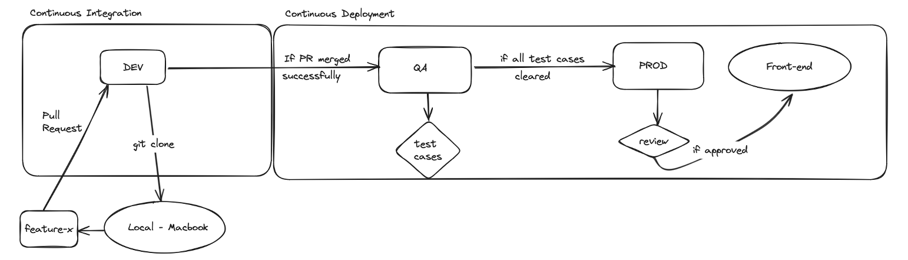
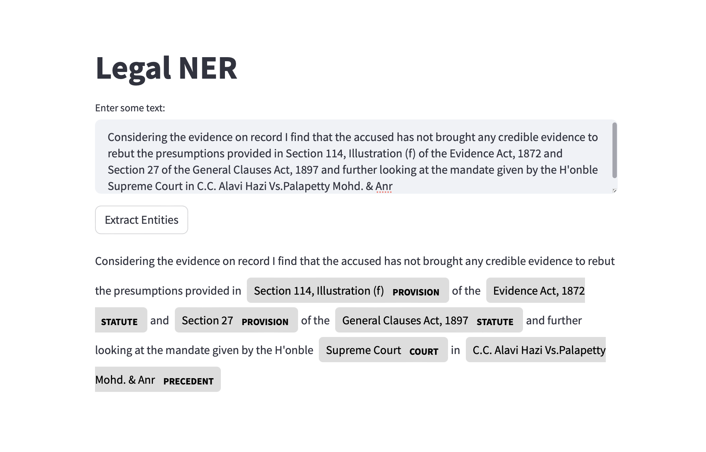

Legal NER (end-to-end MLOps workflow)
==============================
paper: https://aclanthology.org/2022.nllp-1.15.pdf

## 1. Project Organization
------------

    ├── LICENSE
    ├── Makefile           <- Makefile with commands like `make data` or `make train`
    ├── README.md          <- The top-level README for this project.
    │
    ├── app
    │   └── app.py         <- Streamlit app to deploy in hugging face spaces.
    │
    ├── tests              <- test cases for functional & unit testing.
    │          
    ├── data
    │   ├── interim        <- Intermediate data that has been transformed.
    │   ├── processed      <- The final, canonical data sets for modeling.
    │   └── raw            <- The original, immutable data dump.
    │
    ├── docs               <- A default Sphinx project; see sphinx-doc.org for details
    │
    ├── models             <- Trained and serialized models
    │
    ├── reports            <- Generated analysis as .txt
    │   └── figures        <- Generated graphics and figures to be used in reporting
    │
    ├── requirements.txt   <- The requirements file for reproducing the environment
    │
    ├── src                <- Source code for use in this project.
    │   ├── __init__.py    <- Makes src a Python module
    │   │
    │   ├── data           <- Scripts to transform raw data
    │   │   └── make_dataset.py
    │   │
    │   ├── features       <- Scripts to turn transformed data into features for modeling
    │   │   └── build_features.py
    │   │
    │   ├── models         <- Scripts to train models and then use trained models to make
    │   │   │                 predictions
    │   │   ├── predict_model.py
    │   │   └── train_model.py
    │   │
    │   └── visualization  <- Scripts to create results oriented visualizations
    │       └── visualize.py
    │
    └── .github            <- YAML files for managing CI/CD workflow
        ├── ci.yml      
        └── cd.yml  

--------

## 2. Workflow Architecture

------------

## 3. Frontend Sample
The HF space dies after inactivity for some time because this project uses the free-tier 😃. Trigger a new end-to-end run to refresh the front-end
deployed link: https://huggingface.co/spaces/ali-waheed-aw/legal-ner

------------
